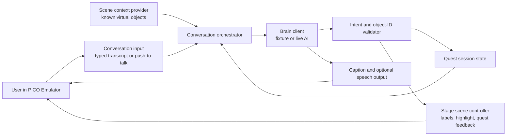

# Project 01: Room Quest to Chore Helper

Status: `PM-0` complete; `PM-1` in progress
Started: 2026-08-18  
Current product marker: `PM-1 — Spatial Object Foundation`
Starting point: PICO Welcome Space `0.13.3`, Spatial SDK `6.0.0`

Documentation rule: Keep all Project 01 requirements, experiments, decisions, and checkpoints in this file under dated sections. Do not create additional `PROJECT_01*.md` planning files.

## Product goal

Build a simulator-first spatial learning experience that grows, one independently demoable product marker at a time, into an AI Chore Helper.

The first useful product is **Spatial Language Quest**: point at virtual household objects to learn their names, then find and place those objects by following instructions. Those same selection, highlighting, placement, planning, and scoring systems will become **Tidy Room Coach** and ultimately the full **Chore Helper** for a real room.

The final experience should let a user describe chores conversationally, receive a practical order based on time or effort, and get spatial guidance while completing them. Items needing attention are indicated with a pink warning treatment; suggested destinations use a green success treatment. Color must be reinforced by labels, shapes, or motion so it is never the only cue.

## Product promise

> Tell the assistant what you need to accomplish, then let your room become an interactive guide that helps you decide, act, and finish.

## Scope and evidence boundary

We do not currently have a physical PICO device. Development therefore has two explicit tracks:

- **Simulator track (`PM-0` through `PM-7`)**: use known virtual scene entities as simulated perception. This can validate product logic, spatial interaction, labels, highlighting, placement, planning, scoring, lifecycle, and the recorded proof-of-concept story.
- **Device track (`PM-8` and `PM-9`)**: investigate and validate real scene understanding, permissions, spatial alignment, tracking, occlusion, comfort, and performance on supported hardware.

Emulator evidence must never be described as proof of physical object recognition, camera inference, real-room alignment, or headset comfort.

## Marker rules

Status markers:

- `[x]` complete with recorded evidence
- `[~]` in progress or partially validated
- `[ ]` not started
- `[!]` blocked or awaiting a decision

Every product marker must:

1. Produce a user-visible, independently demoable outcome.
2. Preserve a deterministic path so a demonstration does not depend entirely on a live AI service.
3. Define normal, incorrect, empty, reset, and exit behavior where relevant.
4. Pass the smallest appropriate automated checks, a debug build, and the listed emulator or device scenario.
5. Record its evidence and decisions in this file and summarize the session in `PICO_DEVELOPMENT.md`.
6. Remain unchecked until the required evidence actually exists.

## Product marker map

| Marker | Product checkpoint | User-visible proof | Target environment | Status |
| --- | --- | --- | --- | --- |
| PM-0 | Reproducible Baseline | Unmodified Welcome Space launches and can be recorded | Emulator | [x] |
| PM-1 | Spatial Object Foundation | User can select, identify, and reset known room objects | Emulator | [~] |
| PM-2 | “Kore wa nan desuka?” Language Lens | Selected objects reveal an attached label and pronunciation | Emulator | [ ] |
| PM-3 | Spatial Language Quest | User finds prompted objects and earns progress | Emulator | [ ] |
| PM-4 | Point-and-Place Challenge | User follows a spatial instruction to move an object to its destination | Emulator | [ ] |
| PM-5 | Virtual Tidy Room Coach | User completes an ordered cleanup of a deliberately messy virtual room | Emulator | [ ] |
| PM-6 | Conversational Chore Planner | User describes chores and adjusts a structured plan by effort or time | Emulator | [ ] |
| PM-7 | Simulator Chore Helper POC | End-to-end recorded demo combines planning, spatial guidance, placement, and scoring | Emulator | [ ] |
| PM-8 | Real-Space Perception Gate | Supported device proves the minimum viable sensing and alignment approach | Physical device | [ ] |
| PM-9 | Complete Chore Helper | Real-room end-to-end experience meets the final product definition of done | Physical device | [ ] |

## PM-0 — Reproducible Baseline

Outcome: establish a trustworthy development and demonstration loop before changing product behavior.

Checkpoint:

- [x] Android Studio opens the project and completes Gradle sync without an unresolved error.
- [x] `spotlessCheck`, project tests, and `:app:assembleDebug` pass, or each concrete blocker is recorded.
- [x] The managed `Pico_MVP` AVD starts and appears as `emulator-5554` in the PICO device list.
- [x] The unmodified app launches into its default planar experience.
- [x] Furniture Library, volumetric inspection, and Full Space room entry/exit are exercised.
- [x] At least one screenshot or short recording is saved as baseline evidence.
- [x] Existing room objects, scene names, target nodes, and relevant interaction code are inventoried for `PM-1`.

Exit artifact: baseline build/test result, emulator capture, and a shortlist of 5–8 household objects for the first learning set.

## PM-1 — Spatial Object Foundation

Outcome: create the stable object model and interaction seam shared by language learning and tidying.

Planned scope:

- Define a product-level room-object record with a stable semantic ID, scene entity/node reference, display name, category, movable state, and optional destination reference.
- Represent emulator perception with known scene entities rather than camera claims.
- Add selection, deselection, focus feedback, reset, and unavailable-object behavior.
- Keep high-frequency 3D state and transforms in the existing ECS/scene path; keep session state in the surrounding ViewModel/domain patterns.
- Define the `PerceptionProvider` boundary only as far as this marker needs it. The first implementation reports virtual scene objects; a future implementation may report device perception results.

Checkpoint:

- [ ] At least three objects can be selected reliably in the Stage.
- [ ] Selected, unselected, and unavailable states are visibly distinct without depending on color alone.
- [x] The app exposes stable object identity to product logic without leaking editor-only details throughout the UI.
- [x] Reset restores the original object and selection state.
- [x] Stage closure cleans up created entities, listeners, resources, and work owned by the feature.
- [x] Focused automated tests cover pure object/session state.
- [ ] Emulator evidence shows select, deselect, reset, and exit.

Exit artifact: reusable spatial object contract and a recorded three-object interaction demo.

## PM-2 — “Kore wa nan desuka?” Language Lens

Outcome: make pointing at a household object produce a useful language-learning moment.

Working assumption: Japanese is the first content set, but language content should not be hard-wired into spatial interaction code.

Planned scope:

- Attach target-language text, reading/transliteration, native-language meaning, and pronunciation source to the selected object set.
- Show the label spatially associated with the selected object while keeping it readable and out of the manipulation path.
- Support an explicit “What is this?” action through an emulator-friendly control; live speech is not required yet.
- Provide replay, hide, missing-translation, missing-audio, and captions/text fallback behavior.
- Record content source, audio provenance, and usage rights before shipping imported assets.

Checkpoint:

- [ ] Five or more household objects have reviewed language metadata.
- [ ] Point/select reveals the correct attached label.
- [ ] Pronunciation can be played or a clearly labeled text fallback is presented.
- [ ] The label remains understandable from the expected emulator viewpoints.
- [ ] Missing content fails safely without losing navigation or selection.
- [ ] A short emulator recording demonstrates the complete question-and-answer loop.

Exit artifact: a demoable five-object spatial language lens.

## PM-3 — Spatial Language Quest

Outcome: turn object identification into an active spatial retrieval game.

Planned scope:

- Add “find the object” prompts using the `PM-2` content set.
- Add correct, incorrect, hint, skip, retry, completion, and reset states.
- Track session progress and a simple score or streak.
- Use direction and spatial location as part of the task; do not reduce the experience to a planar quiz.
- Provide readable prompts and a controller/mouse-compatible fallback for every essential action.

Checkpoint:

- [ ] A deterministic session presents at least five find-object prompts.
- [ ] Correct and incorrect selections produce clear, non-punitive feedback.
- [ ] Hint, skip, reset, and exit paths work.
- [ ] Scoring is deterministic and covered by focused unit tests.
- [ ] Stage close/reopen does not leave stale quest state unless resume is explicitly chosen.
- [ ] Emulator evidence shows one full quest from start to summary.

Exit artifact: the first complete Spatial Language Quest vertical slice.

## PM-4 — Point-and-Place Challenge

Outcome: establish the spatial manipulation loop that directly connects language learning to chore guidance.

Planned scope:

- Present an action instruction such as “Put the book on the shelf.”
- Indicate the source object with a pink attention treatment plus a non-color cue.
- Indicate the suggested destination with a green destination treatment plus a non-color cue.
- Reuse the sample's target-node placement and Fresnel-feedback patterns where they fit.
- Add drag/manipulate, valid destination, wrong destination, cancel, retry, and reset behavior.

Checkpoint:

- [ ] At least three object-to-destination tasks are supported.
- [ ] Source and destination remain distinguishable with color disabled or ignored.
- [ ] Correct placement is detected deterministically.
- [ ] Incorrect placement can be recovered without restarting the app.
- [ ] Original transforms are restored by reset and after the appropriate lifecycle transition.
- [ ] Emulator evidence shows one correct and one recovered incorrect placement.

Exit artifact: a reliable point-and-place lesson that supplies the core tidy interaction.

## PM-5 — Virtual Tidy Room Coach

Outcome: convert the placement mechanic into a useful, gamified virtual cleanup session.

Planned scope:

- Seed a deterministic messy-room scenario with several misplaced virtual objects.
- Create a structured chore model with priority, effort, estimated duration, dependencies, state, and destination.
- Offer simple session intents such as Quick Win, Balanced, and Deep Clean.
- Order the tasks using deterministic rules before introducing live AI planning.
- Guide one task at a time, allow reprioritization, and award transparent progress rather than arbitrary points.

Checkpoint:

- [ ] A four-or-more-task room can be generated and reset identically.
- [ ] Each effort mode produces an explainable task order.
- [ ] The user can complete, skip, defer, or reprioritize a task.
- [ ] Pink attention and green destination guidance use the `PM-4` interaction contract.
- [ ] Completion state and scoring survive ordinary UI recomposition and remain internally consistent.
- [ ] Emulator evidence shows the room changing from messy to complete.

Exit artifact: a fully playable Virtual Tidy Room Coach.

## PM-6 — Conversational Chore Planner

Outcome: let the user describe chores naturally and collaborate on a practical plan.

Planned scope:

- Accept typed/transcribed statements such as “I need to do laundry, dishes, declutter, and take out the trash.”
- Convert input into the structured chore model, surface assumptions, and ask only necessary follow-up questions.
- Let the user re-plan by available time, energy, urgency, room, or dependency.
- Explain the proposed order briefly and allow direct manual correction.
- Put live model access behind a planner interface with deterministic fixtures/fallbacks; never store credentials in the repository.
- Treat voice capture as a replaceable input adapter. Text input remains the reliable emulator path.

Checkpoint:

- [ ] At least five representative inputs produce a reviewable structured plan.
- [ ] Time/effort changes visibly reorder the plan for a defensible reason.
- [ ] Invalid, ambiguous, empty, offline, and model-error states are recoverable.
- [ ] The user can edit the result before beginning spatial guidance.
- [ ] Deterministic planner tests cover priority, dependency, and fallback behavior.
- [ ] Emulator evidence shows conversation/text input through acceptance of a plan.

Exit artifact: a reliable conversational planning flow connected to the virtual chore model.

## PM-7 — Simulator Chore Helper POC

Outcome: produce the shareable proof of concept that demonstrates the whole product story without pretending the emulator is a real home.

Demo story:

1. The user describes several chores.
2. The assistant proposes and explains an ordered plan based on the user's effort preference.
3. The user enters the messy virtual room.
4. Simulated perception reports the known room objects.
5. The current object and suggested destination receive spatial guidance.
6. The user completes tasks, earns progress, handles one mistake, and finishes the room.
7. The app presents a truthful session summary.

Checkpoint:

- [ ] `PM-1` through `PM-6` are integrated without bypassing their fallback or reset states.
- [ ] The demo can run deterministically without a network dependency.
- [ ] A visible note identifies scene input as simulated perception.
- [ ] Tests and a debug build pass.
- [ ] The full flow runs in the emulator without a blocking crash or lifecycle leak observed in the exercised path.
- [ ] A polished 60–120 second recording and a concise demo script are captured.
- [ ] Known limitations explicitly list all device-only claims still unverified.

Exit artifact: the simulator-complete Chore Helper proof of concept.

## PM-8 — Real-Space Perception Gate

Outcome: determine, with supported physical hardware, which real-room capabilities are sufficiently reliable for the final product.

This is a research and evidence gate, not an automatic implementation promise.

Planned investigations:

- Select and document the target PICO device and OS/SDK compatibility.
- Verify applicable permissions and privacy requirements.
- Evaluate available spatial mesh, plane/semantic data, anchors, tracking, and privacy-preserving perception options against the exact product need.
- Determine whether the app can identify relevant objects, understand destinations, maintain alignment, and observe meaningful completion states.
- Measure lighting, clutter, occlusion, distance, tracking loss, recovery, latency, comfort, and performance.
- Keep raw/sensitive environmental data on the narrowest supported path and disclose what is processed.

Checkpoint:

- [ ] Target hardware and supported SDK path are documented.
- [ ] A minimum three-object real-space experiment is run on-device.
- [ ] Spatial guidance remains acceptably aligned during the defined test movement.
- [ ] Tracking loss and permission denial recover safely.
- [ ] Privacy behavior and data flow are documented accurately.
- [ ] Evidence distinguishes confirmed capability, limitation, workaround, and rejected approach.
- [ ] The final `PerceptionProvider` scope is accepted or the product promise is narrowed.

Exit artifact: an evidence-backed go, narrow, or stop decision for complete Chore Helper perception.

## PM-9 — Complete Chore Helper

Outcome: deliver the end checkpoint—a real-room Chore Helper validated on supported PICO hardware.

Final user journey:

1. The user speaks or types the chores they want to complete.
2. The assistant creates an editable plan based on urgency, dependencies, time, and desired effort.
3. The user enters spatial guidance and grants any required permissions with clear context.
4. The app recognizes or confirms relevant room objects and destinations within the accepted `PM-8` capability boundary.
5. Pink attention guidance and green destination guidance help the user complete one task at a time.
6. The user can correct recognition, reprioritize, pause, resume, or finish manually.
7. Progress and points reflect confirmed actions, and the session ends with a useful summary.

Final definition of done:

- [ ] Planning, guidance, correction, completion, pause/resume, reset, and exit form one coherent journey.
- [ ] Real-world perception meets the reliability boundary accepted at `PM-8`.
- [ ] Essential information is conveyed through more than color and audio alone.
- [ ] Permissions, environmental data, model input/output, retention, and deletion behavior are understandable and documented.
- [ ] Offline/model/sensing failures preserve user control and never fabricate task completion.
- [ ] Automated checks, debug/release builds, and the full on-device acceptance matrix pass.
- [ ] Comfort, performance, tracking, occlusion, lighting, and representative-room results are recorded.
- [ ] Assets and language/audio content have documented provenance and acceptable usage rights.
- [ ] A final on-device demo recording and release-readiness summary exist.

Exit artifact: the whole Chore Helper, with honest device evidence and a documented supported scope.

## Architecture guardrails

- Preserve the sample's separation between planar SpatialUI, volumetric inspection, Full Space Stage, ViewModel/domain state, ECS behavior, and editor-owned assets.
- Use the planar WindowContainer for session setup, plan review, preferences, and summaries.
- Use the Stage only for tasks whose value depends on spatial direction, object location, manipulation, or room-scale simulation.
- Keep the Volumetric WindowContainer optional; use it only if close object inspection materially helps learning or correction.
- Use SpatialUI wrapped in `PicoTheme` for 2D UI. Do not introduce Material or Material3.
- Keep per-frame, sensed, and transform-heavy 3D behavior out of Compose recomposition; prefer ECS and explicit scene updates.
- Pair every opened container, listener, coroutine, loaded resource, entity, and tracking session with lifecycle cleanup.
- Keep live AI, speech, pronunciation, and perception behind narrow adapters with deterministic test doubles.
- Never invent PICO APIs or treat a planned platform capability as verified implementation evidence.

## Product data seams

These are conceptual boundaries, not final API names:

- `RoomObject`: stable product identity and spatial behavior for a household object.
- `LanguageEntry`: target text, reading, meaning, audio/caption source, and provenance.
- `PlacementTarget`: destination identity, acceptance rule, and guidance presentation.
- `ChoreTask`: priority, effort, duration, dependency, location, state, and completion evidence.
- `QuestSession`: prompt order, attempts, hints, score, and completion state.
- `PerceptionProvider`: available objects and their reported spatial state.
- `TaskPlanner`: natural-language or deterministic input to an editable chore plan.
- `SpeechInput` and `PronunciationOutput`: replaceable voice-related adapters with text fallbacks.

Names may change during implementation. New abstractions should be introduced only when the active marker requires them.

## Cross-marker acceptance matrix

| Area | Emulator acceptance | Physical-device acceptance |
| --- | --- | --- |
| Selection | Known objects can be targeted and reset | Physical targeting remains stable under representative movement |
| Labels | Correct content is attached and readable in simulated views | Readability and occlusion are comfortable in the headset |
| Manipulation | Drag/place and recovery are deterministic | Hand/controller interaction is comfortable and robust |
| Perception | Known scene entities produce declared simulated results | Accepted sensing path produces measured real-room results |
| Planning | Fixtures and optional live AI yield editable structured tasks | Voice/network behavior works within documented constraints |
| Guidance | Pink/green plus non-color cues direct the virtual task | Cues remain aligned, visible, and safe in a physical room |
| Completion | Placement/state rules drive transparent progress | Confirmed evidence never overstates real-world completion |
| Lifecycle | Stage/container reset and cleanup are exercised | Pause, resume, tracking loss, and permission changes recover |
| Performance | Build and emulator path have no blocking defect | Measured device performance meets the accepted target |

## Immediate working backlog

1. Use the dated MVP requirements section in this document as the accepted contract for voice, brain, scene context, language testing, and simulator execution.
2. Begin `PM-1` with a product-level room-object record that maps the five stable semantic IDs to the existing scene and node names.
3. Keep editor names and current Compose selection keys behind that mapping rather than exposing them to the brain contract.
4. Write pure object-catalog, selection, snapshot, and invalid-ID tests before changing product UI.
5. Add Stage selection, deselection, focus feedback, reset, and unavailable-object behavior while preserving lifecycle cleanup.
6. Draft and review the Japanese metadata for the five-object set, including content/audio provenance.
7. Do not begin `PM-2` until `PM-1` build, tests, emulator evidence, and decisions are recorded.

## Checkpoint log

Add one entry when a marker starts, changes materially, or completes.

### 2026-08-18 — Roadmap accepted

- Status: Project direction accepted; `PM-0` is next.
- Decision: Start with Spatial Language Quest and grow it through Point-and-Place and Virtual Tidy Room Coach into the complete Chore Helper.
- Evidence: Product plan reviewed against the current Welcome Space capabilities and simulator-only constraint. No build or runtime validation was performed for this documentation checkpoint.
- Next: Run the unchanged sample in PICO Emulator and capture `PM-0` evidence.

### 2026-08-18 — PM-0 build and emulator baseline

- Status: `PM-0` is complete; `PM-1` is next.
- Build evidence: Adding the installed `SpatialEditor` directory to the build process `PATH` resolves `spatialbundle.exe` exit `0xC0000135`. `spotlessCheck test :app:assembleDebug --no-daemon` then completed successfully and generated the debug APK.
- Root cause: `spatial.foundation.dll` imports `nanobind.dll`; PICO Editor `6.0.0` installs that dependency in the sibling `SpatialEditor` directory rather than the `spatialbundle` executable directory. The workaround is process-local and is not hard-coded into the project.
- Emulator evidence: `pico-cli emulator doctor` passed; managed AVD `Pico_MVP` booted as `emulator-5554`; app version `6.0.0` installed and launched as process `3825` during this run.
- Interaction evidence: The default Welcome Space panel, Furniture Library, PICO Art Print volumetric inspection, Full Space room entry, and return to the home panel were directly exercised.
- Capture: `captures/pm0-baseline-2026-08-18.png` was saved locally; `captures/` remains intentionally ignored by Git.
- Runtime note: The app stayed running and the crash buffer returned no entries. The emulator emitted non-crashing error-level Spatial runtime/configuration diagnostics, which should be compared again after product changes.
- IDE evidence: Android Studio `2025.1.4` completed a fresh **Sync Project with Gradle Files** operation with no unresolved error. The IDE only offered an optional Android Gradle Plugin upgrade recommendation.
- Inventory evidence: The five catalog/Stage objects, editor scenes, room nodes, interaction seams, and lifecycle behaviors are recorded in the dated inventory section below.
- Next: Add the `PM-1` product object record and pure tests for the five stable semantic IDs.

### 2026-08-18 — PM-1 spatial object foundation implementation

- Status: `PM-1` is in progress. The object contract, virtual-scene perception seam, deterministic session state, Stage interaction components, reset, cleanup, and pure tests are implemented. Direct select/deselect evidence is still pending.
- Product contract: Added validated stable IDs for `xr_headset`, `vase`, `headphones`, `art_print`, and `desk_lamp`, with category, display resources, movable state, optional destination, and centralized mappings to the current editor scene/node names.
- Perception boundary: Added a minimal `PerceptionProvider` and `VirtualScenePerceptionProvider`; the emulator reports known virtual scene entities only and makes no camera or physical-room recognition claim.
- Session behavior: Added explicit `AVAILABLE`, `IN_ROOM`, `SELECTED`, and `UNAVAILABLE` states with deterministic place, toggle, reset, unknown-object, and not-in-room results. Product state remains outside the ECS entity wrappers.
- Stage behavior: The five model entities receive runtime bounding-box colliders, `InteractableComponent`, and `HoverEffectComponent`; the tap recognizer uses a bounded `SpatialView` and targets the loaded room hierarchy. Selected state is designed to combine persistent Fresnel feedback with the planar `Selected` label.
- UI behavior: Catalog actions and status rendering now use stable product IDs. `In room`, `Selected`, and `Unavailable` labels supplement visual treatments, and the room has an explicit reset action.
- Lifecycle behavior: Runtime interaction components, selection material handles, loaded room/IBL entities, maps, and deferred work are released by the owning ViewModels. No editor-authored scene or generated build output was manually changed.
- Automated evidence: `spotlessApply spotlessCheck test :app:assembleDebug --no-daemon` passes on the final tree in 1 minute 17 seconds (109 tasks). Focused catalog/session tests execute successfully. The SpatialUI design verifier passes with zero errors and zero warnings.
- Emulator evidence: PICO Emulator `6.0.0` loaded all five objects; the UI changed placed objects to `In room`; runtime logs recorded placement and reset; reset hid the placed headset and restored its add action; exiting returned to Welcome Space; the app process remained alive and the crash buffer was empty.
- Interaction limitation: Both left-controller and Eye Gesture automation produced visible `HoverEffect` focus on the placed headset, but no `detectSpatialTapGesture` callback reached the diagnostic boundary. The official bounded `SpatialView` and `TargetEntity.hit(roomRoot)` hierarchy pattern is now implemented, but select/deselect is deliberately not marked verified until a manual emulator click or physical-device run produces callback/log and state evidence.
- Local emulator note: `Pico_MVP.avd/controller_settings.ini` maps the left trigger to Qt key code `81` (`Q`). Controller-button mode and ordinary planar activation were exercised, but keyboard and automated pointer injection are not accepted as proof of a 3D tap callback.
- Next: Manually click a hovered placed model in PICO Emulator (or use a physical device), capture `PM-1 tap [...]` select and deselect logs plus the non-color `Selected` label, then repeat for three models before completing `PM-1`.

### 2026-08-18 — PM-1 manual PICO Emulator acceptance runbook

Purpose: close the remaining `PM-1` interaction checkpoint with direct simulator evidence. Hover alone is not a pass. A passing selection must change product state, show persistent feedback after the pointer moves away, and log the stable product ID.

#### 1. Build, start, install, and launch

Run from the repository root in PowerShell:

```powershell
$env:JAVA_HOME = 'C:\Program Files\Android\Android Studio\jbr'
$env:PATH = "$env:LOCALAPPDATA\PICO\sdk\6.0\editor\SpatialEditor;$env:PATH"
.\gradlew.bat spotlessCheck test :app:assembleDebug --no-daemon

pico-cli emulator start --avd Pico_MVP --wait-timeout 180 -y
pico-cli device list --format json
$env:PICO_CLI_DEVICE = 'emulator-5554'

pico-cli app install .\app\build\outputs\apk\debug\app-debug.apk
pico-cli app launch com.pico.spatial.sample.welcomespace --activity .platform.LaunchActivity
```

Expected:

- Gradle ends with `BUILD SUCCESSFUL` and the debug APK exists.
- The device list contains one online `emulator-5554` target.
- Install and launch commands succeed, and the Welcome Space home panel appears.
- Stop at the home panel. Do not select **Enter Room** until the logger in the next step prints its explicit attached message.
- The app remains running. A launch command alone is not proof that 3D interaction works.

#### 2. Attach the lifecycle log before entering the room

Open a second PowerShell terminal in the repository root:

```powershell
$env:PICO_CLI_DEVICE = 'emulator-5554'
$platformAdb = "$env:LOCALAPPDATA\Android\Sdk\platform-tools\adb.exe"
$appProcessId = (& $platformAdb -s emulator-5554 shell pidof com.pico.spatial.sample.welcomespace).Trim()
if (-not $appProcessId) { throw 'Welcome Space is not running on emulator-5554.' }

New-Item -ItemType Directory -Force .\captures | Out-Null
$stageLogPath = Join-Path (Resolve-Path .\captures).Path "pm1-stage-lifecycle-$((Get-Date).ToString('yyyyMMdd-HHmmss')).log"
"Logger attached before Enter Room; writing $stageLogPath" |
    Tee-Object -FilePath $stageLogPath

pico-cli app logcat --pid $appProcessId --lines 50 --level I --follow |
    Select-String -Pattern 'SpatialPack_SpatialContainer|LifeCycle|RoomScene' |
    Tee-Object -FilePath $stageLogPath -Append
```

Wait until `Logger attached before Enter Room` is visible, then select **Enter Room** in the emulator. Leave this terminal open during the test and press `Ctrl+C` after evidence is captured.

The older `--tag RoomScene` command could appear to start late because the app emits no `RoomScene` messages on the home screen. Its first matching event occurs only after the Stage opens and the room finishes loading. The broader stream above is already attached before entry and also captures Stage open, focus, and close/destroy events.

Expected entry evidence includes:

```text
opening stage room with [style:FULL,...]
Stage-room onContainerCreate
PM-1 scene ready: 5 room objects available
```

The exact lifecycle lines may contain additional fields. A correct Full Stage should report immersion `100` and `useSystemEnvironment=false`.

#### 3. Configure simulator input

1. In the emulator's lower-right **Change Mode** control, choose **Eye Gesture Mode**.
2. Keep **Enable Controller Button Mode** on the left toolbar disabled. On the installed emulator, a purple/highlighted gamepad control means it is enabled; click it once so it is not highlighted.
3. Move the mouse to aim the gaze cursor. Use one ordinary left mouse click to simulate the pinch/confirm action.
4. Do not use `adb shell input tap` for this test. It injects 2D coordinates and is not accepted evidence for a volumetric or Stage hit.

Expected: moving over a placed 3D model produces the temporary PICO hover effect. That proves focus only; it does not prove selection.

If a placed model is hidden by the planar panel, move the emulator viewpoint using the controls shown by the emulator, then return to **Eye Gesture Mode** before clicking. Testing one placed object at a time also reduces occlusion.

#### 4. Prove select and deselect on three objects

Use `xr_headset`, `vase`, and `art_print` unless one is visually inaccessible; any three of the five stable objects are acceptable.

For each object:

1. On the Welcome Space home panel, select **Enter Room** before the first object. After resetting between objects, remain in the Stage and continue with the next object.
2. Wait for the room to finish loading. Do not interact while cards are temporarily `Unavailable`; after `PM-1 scene ready`, all five normal targets should expose their add action.
3. Select the object's `+` add action. The card must change to `In room`, the model must appear at its authored room position, and the log must contain `PM-1 place [<id>]: APPLIED`.
4. Aim at the placed model itself—not its card preview—until the temporary hover effect appears.
5. Left-click once, then move the pointer away from the model.
6. Confirm all three selection signals:
   - the card changes from `In room` to the text label `Selected`;
   - the model keeps the persistent Fresnel selection treatment after hover ends;
   - the log contains `PM-1 tap [<id>]: APPLIED`.
7. Aim at the same model and left-click again.
8. Confirm all three deselection signals:
   - the card returns to `In room`;
   - the persistent selection treatment clears after hover ends;
   - the log contains `PM-1 tap [<id>]: DESELECTED`.
9. Select **Reset room** before testing the next object, or keep several objects placed and verify that selecting a second object returns the first card to `In room`. Only one object may be selected at a time.

Expected log sequence for each object:

```text
PM-1 place [xr_headset]: APPLIED
PM-1 tap [xr_headset]: APPLIED
PM-1 tap [xr_headset]: DESELECTED
```

The bracketed ID changes for each model. Editor names such as `PicoEquipment` are not acceptable product-level evidence.

#### 5. Prove reset and Stage exit

1. Place and select at least one object.
2. Select **Reset room**.
3. Confirm that all five cards return to their add action, all placed product models are hidden, no card says `Selected`, and no persistent selection treatment remains.
4. Confirm the log contains `PM-1 room reset`.
5. Use the top-left back control to exit the Stage.
6. Confirm the Welcome Space home panel returns, the app does not close, and re-entering the room starts with a fresh room state.

#### 6. Record evidence and check crashes

Use the PICO Emulator's built-in screen-recording control for the spatial proof. Record one continuous clip containing three object select/deselect cycles, reset, and Stage exit. Save it locally under `captures/`, which is intentionally ignored by Git.

After stopping the live log, collect the recent interaction and crash evidence:

```powershell
pico-cli app logcat --pid $appProcessId --lines 300 --tag RoomScene --level I
pico-cli app logcat --pid $appProcessId --buffer crash --lines 200 --level E
```

Expected: the interaction log contains the scene-ready, placement, select, deselect, and reset lines; the crash-buffer command returns no app crash entry. If a CLI screenshot of the spatial compositor is black, use the emulator's built-in screenshot or recording control instead.

#### 7. PM-1 pass/fail rule

`PM-1` passes only when:

- three distinct stable IDs each produce a visible hover, `Selected` label, persistent selection feedback, `APPLIED` tap log, visible deselection, and `DESELECTED` tap log;
- only one object is selected at a time;
- reset restores the original room state;
- Stage exit returns to Welcome Space without an app crash; and
- the recording and filtered logs are retained as local evidence.

Troubleshooting classification:

| Observation | Interpretation and next check |
| --- | --- |
| No hover | The 3D target is not focused. Confirm the object is placed, aim at the model rather than its preview, and move the viewpoint if the panel occludes it. |
| Hover works but no `Selected` label or tap log | First confirm Eye Gesture Mode and disable Controller Button Mode. If a direct manual click still fails, record it as a runtime interaction defect rather than a pass. |
| `Selected` appears but the highlight disappears with hover | Persistent selection feedback is defective; do not pass the visual checkpoint. |
| A tap log reports an unknown or wrong ID | The entity-to-product mapping is defective; retain the exact line and the object clicked. |
| `Unavailable` appears only while the room is loading | Wait for `PM-1 scene ready`; transient loading state is not the unavailable-path acceptance test. |
| `Unavailable` remains after scene-ready | Treat it as a missing target/scene defect. Do not modify editor assets merely to finish this acceptance run. |
| App closes or returns to the launcher | Collect the crash buffer and retain the recording; lifecycle acceptance failed. |

The explicit `Unavailable` state and invalid-object transitions are already covered by pure tests. A true runtime missing-node proof should use a dedicated future debug fixture; transient loading or destructive asset edits are not accepted substitutes.

### 2026-08-18 — PM-1 manual placement and overlapping-room report

- Status: `PM-1` remains in progress.
- User-reported evidence: each tested add action made its model appear in the room and changed the product card to `In room`. This is accepted as manual placement feedback, but it does not prove the direct 3D select/deselect callback because no `Selected` label or `PM-1 tap [...]` log was reported.
- Reported defect: the app-authored room appeared to overlap the emulator's starting simulation room. After moving the simulated viewpoint, the app room disappeared and the starting simulation room became visible.
- Repeat result: the user reproduced the same visual behavior. The original `RoomScene`-only logging command appeared to begin after room entry because that tag has no pre-entry event; this is a logging-instruction ambiguity, not evidence that the Stage was created before logging attached.
- Runtime inspection: the current process is still running without a crash. Logs show exactly one app Stage named `room`, opened with `style:FULL`, `immersion=100`, and `useSystemEnvironment=false`; no second app Stage or second `WelcomeSpace_VR` load was found.
- Scene inspection: `WelcomeSpace_VR` is loaded once as a finite model and positioned at `(0.15, 0, -3.6)` with a `-30` degree yaw. The app does not intentionally spawn the emulator environment.
- Current evidence: `captures/pm1-double-room-report-2026-08-18.png` was retained locally for comparison. It shows the Decorate Space panel and app room while the Stage is active; it does not by itself capture the disappearance transition.
- Working diagnosis: moving the simulated HMD likely crosses outside or behind the finite, interior-facing room shell, causing room surfaces to leave view or be back-face culled. The emulator then exposes its base-room backdrop. PICO's SDK contract says a `Full` Stage should block the underlying real/simulated environment, so backdrop visibility while this Stage remains active should be treated as an emulator compositor/scene-boundary issue rather than expected product behavior. This diagnosis remains provisional until the transition is recorded.
- Next discriminator test: record the transition and note whether the Decorate Space panel remains visible. If the panel remains, the Stage is alive and the problem is room bounds/back-face/background composition. If the panel disappears or the home panel returns, investigate Stage lifecycle. Use the emulator's view reset/recenter control; if the app room returns immediately, that further supports a viewpoint-versus-finite-scene cause.
- Product consequence: do not block placement-state work on this symptom, but resolve or visibly contain it before the shareable simulator POC. Likely containment options are a distinct enclosing sky/background mesh and a validated starting viewpoint inside the authored room; neither is implemented or accepted yet.

## 2026-08-18 — MVP voice, brain, scene context, and simulator requirements

- Status: Accepted requirements baseline; implementation not started
- Version: `0.1`
- Product markers: `PM-0` through `PM-3`

### 1. MVP outcome

The first runnable MVP is a **Spatial Language Quest** in the existing Welcome Space room.

The user chooses Japanese, enters the Full Space Stage, points at a known virtual household object, and asks “What is this?” The assistant uses a semantic snapshot of the scene to identify the selected object, displays reviewed Japanese learning content beside it, and optionally speaks the pronunciation. The same session can then ask the user to find another object and respond to correct or incorrect selections.

The MVP is complete only when that flow can be demonstrated deterministically in PICO Emulator. Live AI and live voice enhance the MVP, but neither is allowed to become the only way to run or test it.

### 2. MVP boundaries

Included:

- Five reviewed household objects from the existing scene.
- Japanese target-language content with English guidance.
- Object selection, attached labels, reveal/replay, and a find-object quest.
- A semantic scene snapshot containing known virtual object identities and session state.
- A replaceable AI brain with deterministic and live implementations.
- Typed transcript input, captions, and optional synthesized speech.
- PICO Emulator interaction and recording evidence.

Deferred:

- Real-room camera or object recognition.
- Spatial mesh interpretation as household-object recognition.
- Physical anchors, real-room persistence, and real-world completion detection.
- Always-listening voice input or wake words.
- Long-term personal memory.
- Chore planning, object placement, and gamification beyond the first find-object score.
- Claims about physical-device comfort, occlusion, microphone quality, or tracking.

### 3. Accepted implementation sequence

| Step | Input | Brain | Output | Purpose |
| --- | --- | --- | --- | --- |
| A | Typed transcript | Deterministic fixture | Caption + spatial action | Make every product path testable without network or microphone |
| B | Typed transcript | Live AI | Caption + validated spatial action | Validate real model reasoning with controlled scene context |
| C | Typed transcript | Live or fixture | Caption + synthesized speech | Validate audio output independently of capture |
| D | Push-to-talk microphone | Live or fixture | Caption + speech | Add real voice only after emulator microphone behavior is proven |

This sequence is a product requirement, not merely a development convenience. Text and deterministic fallbacks remain available after voice is added.

### 4. System boundary



The brain never receives an unrestricted ECS handle and never manipulates scene entities directly. It proposes an allowlisted intent using stable product object IDs. Local application code validates that intent against the current scene and session before changing visible state.

### 5. Functional requirements

#### 5.1 Conversation interface

- `FR-C01` The user can begin an explicit Ask action from the planar UI or Stage interaction surface.
- `FR-C02` PICO Emulator supports a typed transcript path using keyboard text input.
- `FR-C03` The interface exposes distinct Idle, Listening/Input, Thinking, Speaking, Complete, and Recoverable Error states.
- `FR-C04` Every assistant response has a visible caption, including pronunciation output and errors.
- `FR-C05` The user can cancel, retry, repeat, or hide the latest response.
- `FR-C06` Essential actions remain usable when microphone capture, speech recognition, speech output, network access, or the live brain is unavailable.
- `FR-C07` Push-to-talk is preferred over always-listening behavior for the MVP.

#### 5.2 AI brain

- `FR-B01` The brain accepts the user transcript, learning locale, interaction mode, semantic scene snapshot, selected object ID, and a bounded session summary.
- `FR-B02` The brain returns display text, optional speech text, and zero or more structured product intents.
- `FR-B03` Initial allowlisted intents are limited to showing a language label, replaying pronunciation, starting a find-object prompt, giving a hint, and ending the quest.
- `FR-B04` Every intent that references an object must use a stable object ID present in the supplied scene snapshot.
- `FR-B05` Unknown intent types, unknown objects, malformed responses, timeouts, and unavailable services fail safely without changing the scene.
- `FR-B06` `FixtureBrain` provides deterministic responses for every acceptance scenario.
- `FR-B07` `LiveBrain` implements the same contract without changing Stage or ViewModel callers.
- `FR-B08` The brain may summarize the current session but does not retain cross-session personal memory in the MVP.
- `FR-B09` A live model is not the source of truth for Japanese labels or pronunciation content; it selects from reviewed content owned by the app.

#### 5.3 Scene context

- `FR-S01` The context provider reports stable product object IDs rather than editor node names as the public brain contract.
- `FR-S02` Each reported object may include category, visibility, selectable state, movable state, coarse spatial relation, and available destination IDs only when required by the active task.
- `FR-S03` The snapshot identifies the selected object, active prompt target, interaction mode, and quest progress.
- `FR-S04` Scene context is refreshed on meaningful events such as selection, quest transition, placement, or Stage reload—not every rendered frame.
- `FR-S05` Exact transforms remain local unless a later requirement proves that the brain needs them.
- `FR-S06` The simulator implementation reports known virtual scene entities and is visibly described as simulated perception in demos.
- `FR-S07` No raw VST image, camera frame, physical-room claim, or sensitive environment data enters the MVP brain request.

Conceptual snapshot:

```json
{
  "learningLocale": "ja-JP",
  "mode": "identify",
  "selectedObjectId": "desk_lamp",
  "objects": [
    {
      "id": "desk_lamp",
      "category": "lighting",
      "visible": true,
      "selectable": true
    }
  ],
  "quest": {
    "targetObjectId": null,
    "attempts": 0
  }
}
```

The final Kotlin model and serialized field names may differ. This example defines the information boundary, not an SDK API.

#### 5.4 Language content

- `FR-L01` Japanese (`ja-JP`) is the first target language; English is the initial guidance language.
- `FR-L02` The first set contains five existing scene objects chosen after the `PM-0` inventory.
- `FR-L03` Every language entry contains a stable object ID, Japanese display form, kana reading when useful, romanization, concise English gloss, pronunciation source, and provenance/review status.
- `FR-L04` Content used for acceptance must be reviewed by a qualified human or checked against an authoritative language source.
- `FR-L05` The assistant can answer “What is this?”, reveal the same answer from a button, and repeat it without calling the live brain again.
- `FR-L06` Missing or unreviewed content produces a clear fallback and is never invented as accepted learning material.
- `FR-L07` The quest can ask the user to find an object using Japanese, English, or both according to the selected difficulty.
- `FR-L08` Correct and incorrect feedback is encouraging, concise, captioned, and recoverable.

Provisional examples for test design only:

| Object ID | Japanese | Reading | Romanization | English |
| --- | --- | --- | --- | --- |
| `desk_lamp` | デスクランプ | デスクランプ | desuku ranpu | desk lamp |
| `vase` | 花瓶 | かびん | kabin | vase |

These examples are not marked reviewed by this requirements document.

#### 5.5 Spatial experience

- `FR-X01` Session setup, language selection, transcript entry, and summary use the existing planar WindowContainer architecture.
- `FR-X02` Object identification and find-object tasks run in the existing Full Space Stage because direction and object location are part of the task.
- `FR-X03` The selected object receives clear focus feedback without relying on color alone.
- `FR-X04` The language label remains spatially associated with its object while staying readable and outside the primary manipulation path.
- `FR-X05` The user can select through PICO Emulator Eye Gesture Mode and a controller-mode fallback.
- `FR-X06` Incorrect selection, missing object, Stage reload, reset, and exit have explicit recovery behavior.
- `FR-X07` All resources, listeners, jobs, labels, and temporary scene state created by the feature are cleaned up with the owning container/session lifecycle.

### 6. Non-functional requirements

- `NFR-01 Determinism`: the full MVP acceptance story runs without external network access through fixtures.
- `NFR-02 Responsiveness`: input acknowledgment is immediate; provisional targets are under 500 ms for fixture response and under 3 seconds to first useful live response. These are measurement targets, not verified performance claims.
- `NFR-03 Accessibility`: captions are always available; important state is not communicated by color or audio alone; repeat and text alternatives exist.
- `NFR-04 Privacy`: microphone state is explicit, capture is user-initiated, and the MVP does not retain audio or transcripts beyond the session unless a later opt-in requirement is accepted.
- `NFR-05 Security`: no provider credentials, tokens, or private endpoints are committed to the repository or embedded in a distributable APK.
- `NFR-06 Trust`: the UI distinguishes reviewed language content, fixture behavior, live AI behavior, and recoverable uncertainty.
- `NFR-07 Lifecycle`: Stage close, app backgrounding, cancellation, and retry cannot leave recording, network, coroutine, audio, or scene work orphaned.
- `NFR-08 Performance`: high-frequency transforms and tracking data stay out of the brain request and Compose recomposition loop.
- `NFR-09 Observability`: development builds can record the current input mode, brain mode, sanitized intent result, selected object ID, and failure category without logging secrets or raw audio.

### 7. Brain contract acceptance examples

| Case | Input/context | Expected result |
| --- | --- | --- |
| `BC-01 Identify selected` | “What is this?” + `desk_lamp` selected | Show the reviewed desk-lamp entry and offer pronunciation |
| `BC-02 Nothing selected` | “What is this?” + no selection | Ask the user to point at an object; no scene mutation |
| `BC-03 Start quest` | “Quiz me” + five available objects | Start a deterministic find-object prompt using an available ID |
| `BC-04 Wrong object` | Quest target `vase`, user selects `desk_lamp` | Encourage retry, retain the target, increment attempts once |
| `BC-05 Correct object` | Quest target `vase`, user selects `vase` | Reveal reviewed content, award deterministic progress, advance |
| `BC-06 Hallucinated ID` | Live brain returns `coffee_mug`, absent from snapshot | Reject intent locally, preserve scene, provide recoverable fallback |
| `BC-07 Service offline` | Live request fails | Offer fixture/retry path and keep transcript editable |
| `BC-08 Missing language data` | Selected object has no reviewed entry | State that content is unavailable; do not invent accepted teaching text |

### 8. Test strategy

#### 8.1 Pure automated tests

- Language repository returns exact reviewed entries and safe missing-content results.
- Scene snapshot contains only allowlisted semantic fields and stable object IDs.
- Brain response parsing rejects unknown intent types and absent object IDs.
- Conversation state transitions cover cancel, retry, timeout, offline, and repeat.
- Quest scoring and attempt counts are deterministic.
- Fixture cases `BC-01` through `BC-08` produce exact expected state transitions.

#### 8.2 Integration tests

- `FixtureBrain` and `LiveBrain` satisfy the same contract tests.
- Selecting a scene object updates the semantic snapshot once.
- A validated Show Label intent creates the expected label state; a rejected intent makes no scene change.
- Stage teardown cancels pending brain/audio work and clears temporary labels.
- Planar setup state passes the chosen language and brain mode into the Stage session.

#### 8.3 Emulator acceptance passes

1. **Offline deterministic pass**: typed transcript + `FixtureBrain` + captions.
2. **Live reasoning pass**: typed transcript + `LiveBrain` + captions, with offline recovery.
3. **Speech-output pass**: either brain + pronunciation/TTS + captions; inspect audio debug state where useful.
4. **Microphone spike**: only after host microphone input is directly verified in the installed PICO Emulator; record supported, unsupported, or workaround evidence.
5. **Interaction pass**: repeat the core flow in Eye Gesture Mode and one controller mode.
6. **Lifecycle pass**: cancel during Thinking, close/reopen Stage, reset, and exit to the planar UI.
7. **Demo pass**: record the complete deterministic story as MP4 or GIF from PICO Emulator.

### 9. PICO Emulator runbook

Current workstation workaround: PICO Editor `6.0.0` installs `nanobind.dll` under `SpatialEditor`, while `spatialbundle.exe` runs from a sibling directory. Add `SpatialEditor` to the current process `PATH`; do not hard-code the workstation path into Gradle or application source.

```powershell
$env:JAVA_HOME = 'C:\Program Files\Android\Android Studio\jbr'
$env:PATH = "$env:LOCALAPPDATA\PICO\sdk\6.0\editor\SpatialEditor;$env:PATH"
.\gradlew.bat spotlessCheck test :app:assembleDebug --no-daemon
pico-cli emulator start --avd Pico_MVP --wait-timeout 180 -y
pico-cli device list --format json
```

Then:

1. Install the verified debug APK with `pico-cli app install` and launch it with the explicit package and `.platform.LaunchActivity`.
2. Use Eye Gesture Mode for mouse-aimed selection and click-as-pinch confirmation.
3. Enable PICO Emulator Keyboard Mode when entering typed transcripts.
4. Use controller mode for the required fallback pass.
5. Enable relevant Debug UI overlays for collision, bounds, axes, or audio when diagnosing interaction/output.
6. Use the emulator's built-in recording control for acceptance evidence.
7. Record the app commit, brain mode, input mode, fixture set, and known limitations with each capture.

### 10. MVP exit criteria

- [x] The `PM-0` build/emulator blocker is resolved or a reproducible supported workaround is documented.
- [ ] Five objects and their stable product IDs are integrated.
- [ ] Five Japanese entries are reviewed and have documented provenance.
- [ ] `FixtureBrain` passes all brain contract cases.
- [ ] Typed Ask, Identify, Repeat, Find, Wrong, Correct, Reset, and Exit paths work in PICO Emulator.
- [ ] Captions are present for every assistant response.
- [ ] Live AI works with typed input or is documented as deferred without blocking the deterministic MVP.
- [ ] Speech output works or has an accepted caption-only fallback for this marker.
- [ ] Microphone support has a measured result but does not block typed MVP acceptance.
- [ ] Automated checks, debug assembly, lifecycle pass, and deterministic demo recording succeed.
- [ ] The demo clearly labels scene input as simulated perception.

### 11. Open decisions

- Which five existing scene objects form the initial language set?
- Which authoritative source or reviewer approves Japanese content?
- Which live brain provider and hosting path will be used?
- Will speech recognition and speech output use one realtime service or separate adapters?
- Can the installed PICO Emulator consume the host microphone reliably on this workstation?
- What transcript/audio retention policy, if any, is needed after the MVP?

### 12. Official references reviewed

- [PICO Emulator UI](https://developer.picoxr.com/document/spatial-toolkit/pico-emulator-ui/) — keyboard input, eye/pinch and controller modes, navigation, MR simulation, screenshots, and recording.
- [PICO Emulator UI debugging](https://developer.picoxr.com/document/spatial-toolkit/ui-debug/) — collision, bounds, axes, audio, anchor, plane, and spatial-mesh debug overlays.
- [PICO spatial design guidance](https://developer.picoxr.com/document/spatial-design/) — multimodal input, visible feedback, auditory focus, accessibility, and comfort guidance.
- [PICO Spatial SDK environment setup](https://developer.picoxr.com/document/spatial-sdk/set-up-development-environment/) — supported development and emulator workflow.

Reviewed 2026-08-18. The `pico-dev-knowledge` MCP was not callable in this session, so requirements were grounded in official public documentation and current project evidence.

## 2026-08-18 — PM-0 scene and interaction inventory

- Status: Accepted `PM-0` inventory and initial `PM-1` object shortlist
- Source of truth reviewed: application catalog, Compose/ViewModel flow, container registration, Stage loading path, and Spatial Editor USDA scene definitions

### Five-object shortlist and stable IDs

| Stable product ID | Current UI label | Bundle scene | Full Space target node | Initial role |
| --- | --- | --- | --- | --- |
| `xr_headset` | PICO XR Headset | `PicoEquipment` | `SM_Picoequipment_001` | Large technology object; useful selection-scale contrast |
| `vase` | Modern Designer Vase | `PicoVase` | `SM_Picovase_001` | Familiar household noun and compact décor object |
| `headphones` | Noise-Cancelling Headphones | `PicoEarphone` | `SM_Picoearphone_001` | Familiar wearable object and semantic-name mapping test |
| `art_print` | PICO Art Print | `PicoPainting` | `SM_PicoPainting_001` | Wall-oriented object and spatial-relation contrast |
| `desk_lamp` | Minimalist Desk Lamp | `PicoDeskLamp` | `SM_Picodesklamp_001` | Familiar household noun and future destination/guidance candidate |

These product IDs are the public domain and brain-contract identities. Current bundle scene names, room node names, localized string resources, and future editor changes remain implementation mappings.

### Scene and asset inventory

- `WelcomeSpace_VR` is the Full Space room scene loaded from `asset://editor-asset.bundle`.
- The five standalone preview scenes are `PicoEquipment.usda`, `PicoVase.usda`, `PicoEarphone.usda`, `PicoPainting.usda`, and `PicoDeskLamp.usda`.
- `WelcomeSpace_VR.usda` contains the five target nodes under `Dynamic_Group` and binds a dedicated Fresnel material to each target.
- `sg_fresnel.usda` is the source shader graph used for placement/highlight feedback.
- Entering Full Space successfully exercised `FullSpaceRoomViewModel.findTargetItems()` for all five catalog entries; its required node lookup did not fail.

### Existing code seams to preserve and extend

- `ModelRepository.kt` is the current catalog source. `ModelCard` combines preview size, bundle scene name, localized strings, and Full Space node name.
- `ItemSelection.kt` owns Compose selection state, currently keyed by bundle scene name rather than a stable semantic ID.
- `FurnitureLibraryPage.kt` opens the volumetric `display_box` WindowContainer and passes the bundle scene name/title through container arguments.
- `ItemDisplayVolume.kt` loads an independent preview entity, adds `InteractableComponent` plus box collision, and supports rotate, scale, lighting, name-tag, and reset controls.
- `DecorateSpacePage.kt` and `DecorateSpaceViewModel.kt` send the selected scene name to `FullSpaceRoomViewModel.showTargetItem()`.
- `FullSpaceRoomViewModel.kt` loads `WelcomeSpace_VR`, resolves each configured node's first child entity, disables targets initially, then enables a target and runs a 15-second Fresnel effect when it is added.
- `Main.kt` registers the default planar WindowContainer, volumetric `display_box`, and Full Space `room` Stage through `mainApp`.
- `MainNavHost.kt`, `FurnitureLibraryPage.kt`, and the scoped ViewModels close Stage/preview containers and selection state during back navigation, pause/destroy, and disposal.

### PM-1 gaps exposed by the inventory

- `PicoEquipment` and `PicoEarphone` are editor-oriented names that do not cleanly express the UI concepts “XR headset” and “headphones”; they must not leak into AI prompts or persisted product state.
- The Full Space targets do not currently receive the preview path's interactable/collision setup, so user object selection needs an explicit Stage-owned interaction seam.
- `findTargetItems()` depends on the first child under each configured node. Preserve current behavior for the first slice, but isolate the lookup so a later editor hierarchy change has one failure boundary.
- `ItemSelectorImpl` accepts arbitrary string keys and can insert unknown entries. `PM-1` needs validated IDs and explicit unavailable-object behavior.
- Preview and Stage entities are separate instances. Product state must bind them through stable IDs rather than retaining ECS entity references outside the owning container lifecycle.
- Fresnel is a useful focus cue but cannot be the only cue; `PM-1` must add a non-color selection indicator and deterministic reset behavior.
